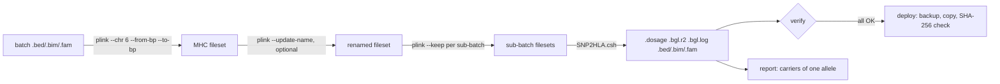

# HLA Pipeline Manager

[](https://github.com/dsugurtuna/hla-pipeline-manager/actions/workflows/ci.yml)

Plan, verify and deploy SNP2HLA imputation of HLA alleles across many genotyping batches.

> **Portfolio disclaimer:** This repository contains sanitised, generalised versions of tooling developed at NIHR BioResource. No real participant data or internal paths are included.

## The problem

Imputing classical HLA alleles for tens of thousands of array samples means splitting each batch into sub-batches, running SNP2HLA (PLINK plus Beagle 3) on each one, and checking thousands of output files before anything is released. A sub-batch that silently failed, or a release copy that was overwritten without a backup, is expensive to discover later.

## What this does

- **Plans a batch.** Builds the exact PLINK and SNP2HLA commands: extract the extended MHC on chromosome 6 (26-34 Mb by default), optionally rename Affymetrix `AX-` probe IDs to rsIDs with `--update-name`, split samples into `--keep` sub-batches, then run `SNP2HLA.csh` per sub-batch. A plan is a dry run; running it is a separate, explicit call.
- **Verifies outputs.** For every sub-batch it checks `.bed/.bim/.fam/.dosage/.bgl.r2/.bgl.log` exist and are non-empty, that HLA allele markers appear in the `.bim` and `.bgl.r2`, and that the Beagle log ends with a completion line. It can also flag sub-batches that produced nothing.
- **Reports carriers of one allele.** Reads PLINK `--recode A` (`.raw`) files or SNP2HLA `.dosage` files, orients HLA presence/absence (`P`/`A`) coding, makes hard calls from dosage and attaches the marker's Beagle r2.
- **Deploys with a backup first.** Copies results into a release directory after a timestamped backup, then checks every copy against its source by SHA-256.

## Quickstart

Uses the synthetic files in [`examples/`](examples/README.md); no PLINK, Java or reference panel needed.

```bash
git clone https://github.com/dsugurtuna/hla-pipeline-manager.git
cd hla-pipeline-manager
python3.11 -m venv .venv && source .venv/bin/activate
pip install -e ".[dev]"
pytest

# 1. Plan a batch of 12 synthetic samples in sub-batches of 5 (prints commands only)
python -m hla_pipeline plan --batch-id demo --bfile examples/synthetic \
  --work-dir /tmp/hla-demo --reference HM_CEU_REF --sub-batch-size 5

# 2. Verify two sub-batch outputs; one has no Beagle log, so this exits with 1
python -m hla_pipeline verify examples/batch --expected 2

# 3. Carrier report for HLA-DRB1*04:01 from a SNP2HLA .dosage file
python -m hla_pipeline report examples/batch/sub_batch_001_imputed.dosage \
  --fam examples/batch/sub_batch_001_imputed.fam --allele HLA_DRB1_0401 \
  --r2 examples/batch/sub_batch_001_imputed.bgl.r2
```

The same steps from Python:

```python
from hla_pipeline import BatchExecutor, PipelineConfig

config = PipelineConfig(reference_panel="HM_CEU_REF", sub_batch_size=5)
plan = BatchExecutor(config).plan_batch("demo", "examples/synthetic", "/tmp/hla-demo")
for argv in plan.commands:
    print(" ".join(argv))
```

To run a plan for real, call `execute_batch(..., dry_run=False)` on a machine with PLINK 1.9, Java and SNP2HLA installed.

## How it works



| Module | Role |
| :--- | :--- |
| `executor.py` | Builds the plan; runs it through an injectable runner |
| `verifier.py` | Output checks per sub-batch and per batch |
| `dosage.py` | Readers for `.raw`, SNP2HLA `.dosage` and `.bgl.r2` |
| `reporter.py` | Hard calls and CSV export |
| `deployer.py` | Backup-first copy with checksum verification |
| `__main__.py` | `plan`, `verify` and `report` commands |

## Design decisions

- **Planning is separate from running.** A plan can be reviewed, logged and tested without the tools; `completed` only counts sub-batches whose commands really exited with status 0. An earlier version reported every planned sub-batch as a success.
- **Commands go through an injectable runner.** Tests replace PLINK and SNP2HLA with a function, so failure handling (one sub-batch fails, or a shared step fails and nothing else runs) is tested without a cluster.
- **Sub-batches come from the input `.fam`.** Region filtering drops variants, never samples, so the split is known before any tool runs.
- **Present-allele dosage is explicit.** PLINK `--recode A` counts the A1 allele, and SNP2HLA's `.dosage` counts allele 1 of each marker. For HLA markers either can be `A` (absent), so the readers flip `x -> 2 - x` when needed instead of assuming.
- **Verification copies the original shell checks.** Non-empty files, HLA rows in `.bim` and `.bgl.r2`, and a completion line in the Beagle log; sub-batches are found from `.dosage` files so input filesets in the same folder are not miscounted.
- **Deployment is not on the command line.** It overwrites release files, so it has to be called on purpose from Python, backs up first and verifies by checksum rather than by file existence.

## Limitations and what it is not

- It does not install or wrap a scheduler. `execute_batch` runs commands one after another; on a cluster you would hand the plan's commands to Slurm or SGE.
- The Beagle completion check is a text heuristic (`finished`, `completed` or `end time` in the last lines of the log).
- Hard calls use fixed thresholds (>= 1.5 homozygous, > 0.5 heterozygous). They are for listing carriers, not a clinical HLA type, and they ignore the uncertainty in the dosage.
- It checks structure, not imputation accuracy. For accuracy you need a typed validation set.
- Only SNP2HLA's output layout is supported, not CookHLA or HIBAG.
- The scripts in `legacy/` are kept as originally published for reference. They are not maintained, not linted, and several contain simulation steps that create placeholder files when inputs are missing.

## Where this fits

One of a set of tools from biobank genomic data provisioning. Before imputation: [vcf-plink-converter](https://github.com/dsugurtuna/vcf-plink-converter) and [genomic-qc-toolkit](https://github.com/dsugurtuna/genomic-qc-toolkit). When a run goes wrong: [hla-imputation-analyst](https://github.com/dsugurtuna/hla-imputation-analyst). After release: [hla-variant-investigator](https://github.com/dsugurtuna/hla-variant-investigator) for carrier look-ups and marker audits.

## Roadmap

- Emit the plan as a Slurm array job script.
- Record tool versions and input checksums in a run manifest.
- Support CookHLA output alongside SNP2HLA.

## Jira Provenance

- **HLA imputation pipeline** — full SNP2HLA/CookHLA orchestration across Cambridge HPC.
- **Batch verification** — validating completeness of thousands of sub-batch outputs.
- **Clinical reporting** — genotype calling and deliverable CSV generation for clinical teams.

## Licence

MIT is declared in `pyproject.toml`, but no licence file is included yet.

---

Personal project by [Ugur Tuna](https://github.com/dsugurtuna). Not affiliated with or endorsed by any employer.
